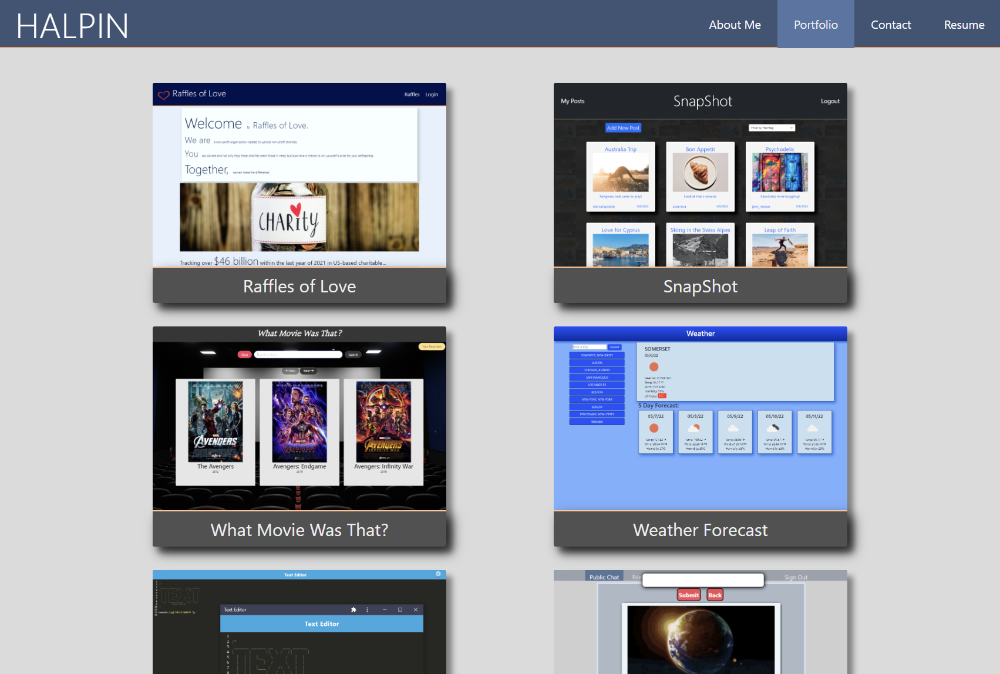
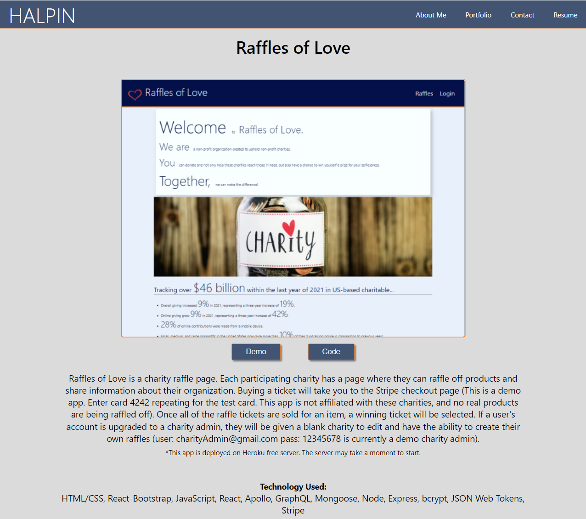
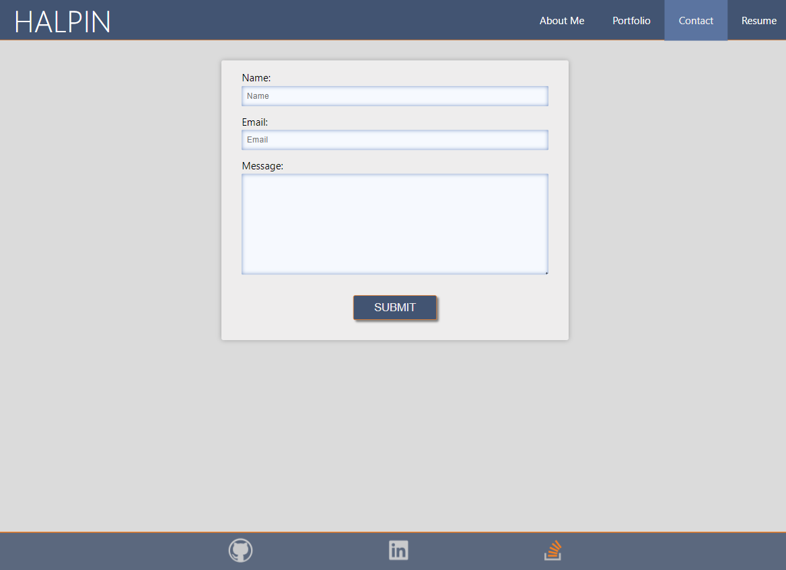
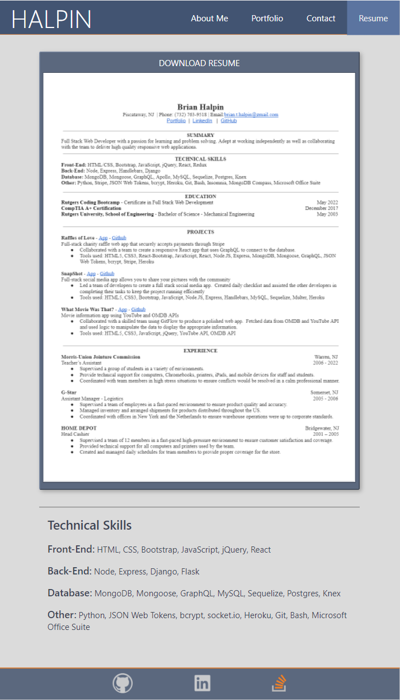

# Portfolio

Hi, I'm Brian Halpin and this is the GitHub repo for my portfolio page.  My portfolio was created using React and using React Router for navigating the different pages.  My portfolio was originally created using JavaScript, but I refactored it with TypeScript.  [Original Portfolio Code](https://github.com/bthalpin/React-Portfolio)

The home page is the About me section with a brief description of who I am.  The portfolio section has a list of six of my top projects, if you click on them you will be taken to a project detail page to get a brief summary of the project and also be presented with a link to the deployed app and the source code on GitHub.  There is also a contact form that uses EmailJS to send out an email.  Finally there is the resume page with a link to download my resume and a brief summary of some of my skills.

I hope you enjoy.  Feel free to contact me directly, or check out my GitHub repository or Linkedin pages by clicking the links in the footer.

## Table of Contents

[Links](#links)

[Media](#media)

[Questions](#questions)

## Links
[Raffles of Love - App](https://charity-raffle.herokuapp.com/)

[Raffles of Love - Code](https://github.com/bthalpin/Raffles-of-Love)

[Portfolio](https://bthalpin.com)

[SnapShot - App](https://snapshot-bh.herokuapp.com/)

[SnapShot - Code](https://github.com/bthalpin/SnapShot)

[What Movie Was That? - App](https://bthalpin.github.io/What-Movie-Was-That/)

[What Movie Was That? - Code](https://github.com/bthalpin/What-Movie-Was-That)

[Weather Forecast - App](https://bthalpin.github.io/Weather-Forecast/)

[Weather Forecast - Code](https://github.com/bthalpin/Weather-Forecast)

[PWA Text Editor - App](https://text-editor-bh.herokuapp.com/)

[PWA Text Editor - Code](https://github.com/bthalpin/text-editor-app)

[Messaging App - App](https://bthalpin.github.io/messagingApp/)

[Messaging App - Code](https://github.com/bthalpin/messagingApp)
        
## Media
The following image displays home page (About Me section):

This image displays the portfolio page:

This is the project detail page:

This image displays the contact page:

This image displays the resume page:

## Questions
If you have any questions contact me directly at <brian.t.halpin@gmail.com>. You can find more of my work at [Brian Halpin](https://github.com/bthalpin).

